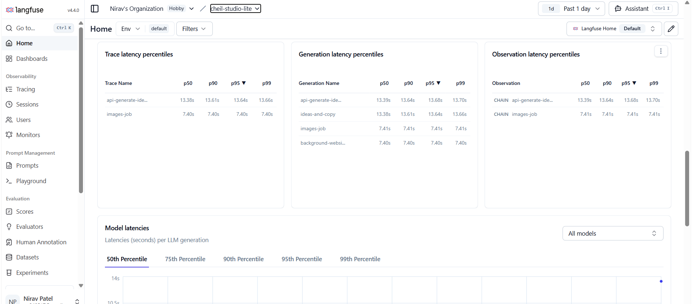

# Architecture and design decisions

Why the code is shaped the way it is. This is the reasoning behind decisions where the
obvious alternative is *worse* rather than merely different — the kind of thing that is
expensive to rediscover and invisible in a diff.

For what the project is and how to run it, see the [README](../README.md). Where a
decision has a single home in the code, the short version is also a comment on the
function itself; this document is the long form.

## Persistence and jobs

**Campaigns are durable, and saving is automatic.** The wizard is one JSON document
written back to SQLite on a debounce. Closing the tab is not destructive, and the home
page lists saved campaigns to resume. Only the columns the list needs (name, type,
status, timestamps) are promoted out of the document — the wizard's shape is still
moving, and a rigid schema would mean a migration per UI change for no query benefit.

**Image generation is a job, not a request.** It takes 10–12s depending on Vertex
capacity, which is far too long to hold a connection open, and the work is billed
whether or not the client is still listening. `POST /api/jobs/images` returns a job id
immediately; the run is detached and records its own outcome, so a reload or a
navigation cannot orphan it. The job id is stored with the campaign, so a resumed
campaign re-attaches instead of paying for the same generation twice.

**Threadpool Offloading**: To avoid starving the ASGI event loop of the Uvicorn server, synchronous SQLite IO operations (`store.create_job()`) invoked inside these asynchronous generation wrappers are completely wrapped in `anyio.to_thread.run_sync()`. This guarantees the server effortlessly scales across hundreds of concurrent LLM web-socket polling connections without local lock-ups.

Ideas generation (~1.5s - 2.5s) deliberately stays synchronous, aggressively optimized by `gemini-2.5-flash-lite`. Durable job state earns its
complexity on long, expensive, retry-prone calls — not on rapid sub-second generative paths.

**Images are served by URL, not inlined.** They are ~1.5 MB each. Previously every one
travelled as a base64 data URI inside JSON, on every request and response that touched
them. They now live in an `images` table and are fetched from `/api/images/{id}`, which
also means the browser caches them and the campaign document stays small. Ids are
random and never mutated, so the responses are `immutable`.

> The prototype runs jobs in-process with `asyncio.create_task`. That is right for a
> single-node local tool and wrong for a deployment — the boundary is already correct,
> so replacing it with a real queue means changing `_run_image_job`, not the API or the
> client.

## Structured output via Pydantic AI

Text endpoints share a Samsung brand-voice system prompt and use the **`pydantic-ai`** orchestrator library strictly enforcing structured output response schemas (`Agent` output_type mapping). This physically guarantees that malformed responses cannot reach the UI. Schemas
return *ordered lists* that the backend zips against the request order rather than asking
the model to echo exact format names back as JSON keys — noticeably more reliable and heavily optimized for `gemini-2.5-flash-lite`.

## Campaign context

Every setup choice reaches the model that needs it:

| | brief | product | background | formats | audiences |
| --- | :-: | :-: | :-: | :-: | :-: |
| `/api/ideas` | ✅ | ✅ | ✅ | ✅ | ✅ all |
| `/api/assets` (video/email) | — | ✅ | Platform / Tone | ✅ | ✅ all |
| image generation | — | ✅ | ✅ style | ✅ aspect | ✅ all |

For image campaigns the banner copy is *not* a second LLM call — it comes from the
selected idea's `headline_*` / `body_*` fields, which were already written with the full
setup as context.

## Product grounding

The image model does not know what a "Galaxy S26" looks like — left to a text prompt it
invented abstract crystals and generic handsets. 

To ensure strict brand compliance, **we completely decoupled the product from the AI illustration**. The frontend now instructs the generation suite to build an entirely *empty* studio or lifestyle environment, requesting generous negative space. Once returned to the client, the original pristine catalog PNG is layered exactly on top using React/Canvas native compositing. This approach completely eliminates architectural hallucinations (e.g., incorrect camera mounts or missing styluses) while retaining dynamic lighting moods in the backdrop. The original product image is passed as context just so the model natively understands the 'vibe' it is styling its empty backdrop for.

Catalog images live in `frontend/public/` as PNG. `productReferencePng()` decodes whatever
the catalog ships through a canvas, so AVIF sources keep working without adding an
image-codec dependency to the backend. A missing or unreadable reference degrades to
ungrounded generation rather than failing the step.

> `frontend/dist/` is Vite build output and is **emptied on every `npm run build`**. Put
> source assets in `frontend/public/`.

## Image generation performance

- **One call per unique aspect ratio, not per format.** The image prompt contains no
  banner-size term, so Website and Desktop (both 16:9) were issuing two byte-identical
  requests. A four-format batch is now three calls.
- **Aspect ratios match the real output.** Hoarding is 1920×480 (4:1); the API rejects
  `4:1` with `400 INVALID_ARGUMENT`, so it uses `21:9` (1536×672) instead of the `16:9`
  it used to request and then crop savagely.
- **Generation is prefetched.** It starts ~1.5s after the user settles on an idea, so it
  overlaps the time they spend on the Ideas step instead of stacking after it. The delay
  keeps browsing between ideas from firing a batch per click, and the result is cached and
  reused by the Assets step rather than re-requested.
- **A throttled format reuses the nearest generated aspect** instead of dropping to a flat
  preset gradient — a cropped real scene is the better failure mode. Reported as
  `degraded` in the response and surfaced in the UI.

Wall time was previously dominated by Vertex shared-capacity throttling and TTFT waits. To resolve this without forcing hostile local throttling or degrading UX, we completely migrated the core generation engine to natively route to `gemini-2.5-flash-lite` and clamped image sizes using deterministic prompt stages, which substantially eliminated 429 backoff capacity exhaustion while dropping end-to-end generation blocks from ~80s down to ~11s.

## Banner layout

Two rules keep the output correct across wildly different aspect ratios. Both are shared
by the editor preview and the canvas export, which **must** stay in sync — every layer is
positioned as a percentage of the same box. The helpers live in
`frontend/src/lib/bannerSpecs.js` and carry the short form of this reasoning as comments.

**Backgrounds fit, they don't always crop.** `backgroundFit()` returns `cover` when the
generated frame nearly matches the banner, and `contain` when it doesn't. No supported
generation ratio is close to Hoarding's 4:1, so covering it discarded 42% of the height
and cut the product in half every time. Instead the whole 21:9 scene is fitted by height
and anchored right, and the space left over becomes the text area. Telling the model to
keep the subject inside a "safe band" was tried first and did not hold — it kept
composing off the top edge.

**The leftover space is a blurred copy of the scene, not the preset gradient.** A dark
photograph beside a bright violet gradient reads as two images butted together no matter
how far the seam is feathered. Filling it with a dimmed, blurred, overscaled copy of the
same image always tones-matches. Blur is a percentage of width (`cqw` in CSS, pixels on
the canvas) so preview and export agree.

**Type scales off the smaller edge** (`cqmin`, and `min(w, h)` on the canvas), not the
height. Sized against height, a 9:16 mobile canvas produced a 144px headline that wrapped
onto three lines and overlapped the body copy. Wide formats are unaffected, since their
height is already the smaller edge.

**The logo scales off the longest edge** (`cqmax`, and `max(w, h)` on the canvas), so the
wordmark keeps the same physical size whatever the banner's shape. Scaled by width alone
it came out 130px on Mobile against 230px everywhere else — the one portrait format, and
the mark read as detached from the layout rather than part of it. `logoWidthPct()`
converts back to a width percentage for the drag clamp.

**The prompt forbids letterboxing.** "Cinematic" invites the model to add bars, and it
did: a measured export carried 115 dead rows across the top and 304 across the bottom,
with the logo stranded in the top band. The prompt now requires the photograph to reach
all four edges. Measured after the change: 0 dark rows top on both Mobile and Hoarding.

Very tall formats are also capped on screen via `previewStyle()`: Mobile at full column
width rendered ~1170px tall, which made the Edit step three screens long. The cap is
applied to *width* derived from a target height — a `max-height` on an aspect-ratio box
would let it go shorter than its ratio and desynchronise the preview from the export.

**Unvisited canvas tabs securely fallback.** If a user rushes straight from Generation (Step 7) to Export (Step 9) without opening every single layout permutation, the ZIP exporter intercepts the empty DOM ref. It automatically synthetically reconstructs the full state payload (incorporating the decoupled PNG graphic, dynamic CSS background, and localized translation slice) entirely dynamically, ensuring the downloaded bundle is flawless regardless of explicit UX traversal.

## Email

Email produces an **export-ready HTML layout**, not just copy. `lib/emailTemplate.js`
builds it to email-client rules — table layout, inline styles, fixed 600px, no
flexbox or grid, since Outlook renders with Word's engine and silently collapses
anything modern. The ZIP carries the `.html` plus a `.txt` so copy can be reviewed and
translated without opening a browser.

**Premium Aesthetic Constraints:** To rival high-fidelity design standards like Apple and Samsung, the email layout builder enforces aggressive structural boundaries natively inside simple `<table width="600">` components. By overriding basic properties with large padding elements (48px internal boundaries), soft typographic grays (`#1D1D1F`), and pill-shaped call-to-action objects (100px radii), the resulting emails feel distinctly premium despite relying entirely on fundamental `HTML 4` structures. Furthermore, the `Design & Typography` panel is decoupled from the AI generator, giving users absolute CSS aesthetic override (Classic/Prestige/Bold styles) without rebilling the model.

The preview is an **iframe fed the exact HTML the ZIP contains**. Rendering it as
ordinary React would have let the app's stylesheet prop up a layout that has to stand
on its own in a mail client. Brand assets are inlined once in the wizard and shared by
both the preview and the exporter, so the two cannot drift.

> Inlined data-URI images make an exported file self-contained and correct when opened
> locally. Real sending would host them — Gmail and Outlook.com strip data URIs. That
> is the right trade for a reviewable artefact and the wrong one for a broadcast.

**Each email type carries its own strategy** (`EMAIL_TYPE_GUIDANCE`), because the model
writes markedly better copy when told what an email is *for* than when left to infer it
from a label. Two types carry the most specific briefs:

**Re-engagement.** Given only that word the model reliably produces "we miss you",
which is the one thing that type must not say. Declining engagement usually means the
content was mismatched, not that interest is gone, so naming it assigns blame and adds
friction. The brief instead frames it as improving the reader's experience and cutting
inbox clutter, and hands over control — the reader picks topics and frequency, and the
call to action sets preferences rather than selling.

**Product & Feature Update.** Aimed at people who already own the product, so it must
not read as a launch. Every update is tied to something the reader actually does with
the device: the outcome leads, never the feature name or a spec on its own, and the
next step is small and specific so it drives adoption.

`preference_options` is populated only for types whose strategy calls for it.

**The re-engagement rule is enforced, not just requested.** `check_reengagement()` scans
the generated copy for phrases that name the reader's absence (EN and fr-CA) and
confirms preference controls are present. Like the logo-placement rule, this is exact
string matching rather than a judgement call, so it is computed in code — instant, free,
and it cannot change its mind between runs. Naming inactivity is a `fail`; missing
preference controls is a `warn`. The check only appears when a re-engagement email is
part of the campaign.

## Document Brief Ingestion
Marketing teams rarely start with plain text; they start with 15-page PDFs. The `POST /api/extract-text` endpoint exists to natively buffer `pypdf` and `python-docx` conversions over multipart file uploads. Instead of having the backend read the file invisibly during AI generation, we extract the string server-side, push it directly into the frontend Text Area, and let the user manually curate exactly what makes it into the final LLM Context. This guarantees no hidden unreviewed text poisons the output pipeline, letting users actively summarize or crop massive catalog PDFs.

**CPU Parsing Thread Isolation:** Because reading massive binaries (`PyPDF`) is extremely CPU bound, `.pdf` and `.docx` routes must not block the main Event Loop. The `/api/extract-text` router isolates exactly this threat by running as a standard `def` block (instead of `async def`), prompting FastAPI to safely offload the synchronous rendering overhead exactly onto an external OS worker threadpool.

## Acting on a quality verdict

`fail` locks the download; `warn` is advisory and still exports. Either way the Export
step offers **Revise copy**, which jumps to Ideas & Copy — the only place the exported
headline and body are editable.

Banner copy is derived from the selected idea and kept in sync with it, so an edit there
reaches the export *without* regenerating the images. That matters: the words are cheap
and the image batch is the slow, billed part. The report is also cleared whenever the copy
changes, so a stale `pass` can never sit above copy it was never run against.

## Observability

Every LLM and image call is traced to [Langfuse](https://cloud.langfuse.com). Tracing is
optional — if `LANGFUSE_PUBLIC_KEY` / `LANGFUSE_SECRET_KEY` are unset, every helper in
`backend/observability.py` degrades to a no-op and the app runs unchanged. No request
should ever fail because tracing is down.

> Prompts and completions contain campaign copy, so enabling this sends that
> content to Langfuse.

| Concept | How it maps |
| --- | --- |
| Trace | One per API request (`ideas-and-copy`, `quality-check`, `assets`, `backgrounds-batch`) |
| Run type | `chain` for orchestration, `generation` for LLM calls, `tool` for image calls, `guardrail` for the review |
| LLM call | Every `_generate` and every image attempt, with the resolved system prompt and model params |
| Tokens | `input`, `output`, `output_reasoning`, `input_cached` |
| Cost | Derived from `PRICING` in `observability.py` — update it if Google changes rates |
| Feedback scores | `guardrail_verdict` (categorical), `guardrail_pass` (0/1), `image_success_rate` (ratio) |
| Quantitative Grading | The LLM-as-a-judge emits a strict JSON 6-metric grading block per review, linearly mapped to Langfuse `obs.score` multi-dimensional arrays to continuously track model alignment degradation. |

**Retries are traced individually.** Each image attempt opens its own generation
observation, so a throttled call that succeeds on attempt 3 shows all three —
retry storms are visible rather than hidden inside one long span.

**Reasoning tokens are counted.** Gemini bills thinking tokens separately from
output. On a trivial call, measured usage was `input=2, output=1,
output_reasoning=23` — tracking only input+output would under-report billed
tokens by roughly 8x. `extract_usage` captures them explicitly.

**Image payloads are never logged** — only `<image N b64 chars>`. Logging the
base64 would add ~1.5 MB to every trace for no diagnostic value.

**The reviewer uses a shorter voice.** `REVIEWER_VOICE` (**45 tokens**) instead of the
full `SAMSUNG_BRAND_VOICE` copywriter brief (**369 tokens**) — a 324-token saving on
every quality check, and more correct, since a reviewer should not be primed to write
like an author.

## Linting

`npm run lint` runs oxlint. `no-undef` is enabled deliberately: a constant used in
`CampaignWizard` but imported only into `BannerEditor` passed `vite build` cleanly and
white-screened at runtime, on one format only. Vite does not do that scope analysis;
the linter does.

##Tracing 

